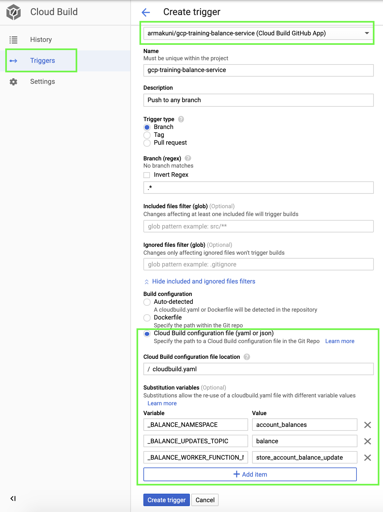

# Balance Services

This repository contains below:

1. GET REST service running on Cloud Run at http://localhost:5005/balance/[ACCOUNT_NUMBER] locally
   
    Response:
  ```json
  {
    "accountNumber": "14662286",
    "clearedBalance": 30
  }
  ```
2. Balance Worker running on Google Function, which is triggered by the "balance" PubSub topic event.
  
   Google Cloud Function is used to retrieve messages from the balance updates topic and store them in the balance Firestore collection.

#### Environment variables

The service uses the below variables in its configuration. They all have default values as shown below if they are not otherwise specified:

```
BALANCE_NAMESPACE(Firestore Collection Name)=account_balances(default)
PORT=5005(default)
APP_NAME=Balance Service App(default)
```

#### Requirements

- A Firestore instance up and running in your Google Cloud account
- Google service account to access the Firestore
- balance update PubSub topic

### To run linter
```bash
make lint
```

### To run tests
```bash
make test
```

### To run the service locally
Before starting the application locally you must create Google Service Account and store credentials json file locally to authenticate.

Once you have stored the credentials locally, export it to the environment variable as below:
```bash
export GOOGLE_APPLICATION_CREDENTIALS=[PATH_TO_CREDENTIALS_FILE]/[SERVICE_ACCOUNT_CREDENTIALS_FILENAME].json 
```

```bash
make run
```
Note: This will only run the Balance GET Service.

#### DO NOT STORE THE CREDENTIALS FILE INSIDE THE REPOSITORY

It is strongly recommended not to store the credentials in the repository as this might lead to a security risk. Unless the file is encrypted, it could be exposed when pushed up if the repository is public, or if the repository is used to create a container image which is stored publicly.

### Deployment

#### Cloud Run

This repository contains a cloudbuild.yaml file to deploy the GET service on to Cloud Run and balance worker on Cloud Function.

```bash
gcloud builds submit --substitutions=_BALANCE_NAMESPACE="[BALANCE_NAMESPACE]",_BALANCE_UPDATES_TOPIC="[BALANCE_TOPIC_ID],_BALANCE_WORKER_FUNCTION_NAME=[BALANCE_WORKER_FUNCTION_NAME]
```

where BALANCE_NAMESPACE: Firestore collection name which the function will use to update the balance data and the cloud run to fetch the balance data.

BALANCE_TOPIC_ID: PubSub topic id where transaction service will push the balance messages.

BALANCE_WORKER_FUNCTION_NAME: Name of the function specified in the ```main.py``` file of balance_worker folder. If you wish to change the function name you must change the function name in the [main.py](/balance_worker/main.py) as well.

If you observe the [cloudbuild.yaml](/cloudbuild.yaml) closely you will identify there is another step declared which creates a PubSub Subscription and links the Transaction Service URL once the Transaction Service is deployed.

* Makes sure that variable name matches with what is been defined in the "cloudbuild.yaml". If you wish to change the variable name then you must replace all the respective references in the [cloudbuild.yaml](/cloudbuild.yaml) as well.
* If you do not specify the substitution parameters (to know more about substitutions [click here](https://cloud.google.com/cloud-build/docs/configuring-builds/substitute-variable-values)) the clouldbuild will use default value specified in the CloudBuild.yaml under substitution section.

#### Setup Cloud Build Trigger to deploy Microservice on each commit

Now let us set up a Cloud Build Trigger to deploy the changes automatically with each commit.

1. Navigate to the Cloud Build page in the console and click ```Triggers```
2. Click ```Create Trigger``` and should open a new page.
3. Enter all the information highlighted in the below image.
4. Set the substitutions variables appropriately (preferably the same as the CLI step). As explained earlier if you wish you change the variable name you must change in the "cloudbuild.yaml" as well.
5. The values specified here will override any default values defined in the "cloudbuild.yaml". If you wish to change the value make a note of it.



6. Click Create Trigger and your trigger should be ready to use.
7. Make a commit and observe Cloud Build to confirm the trigger is working fine.

### API documentation

You can access the API documentation by launching the application and visiting [swagger ui](http://localhost:5002/docs/)

